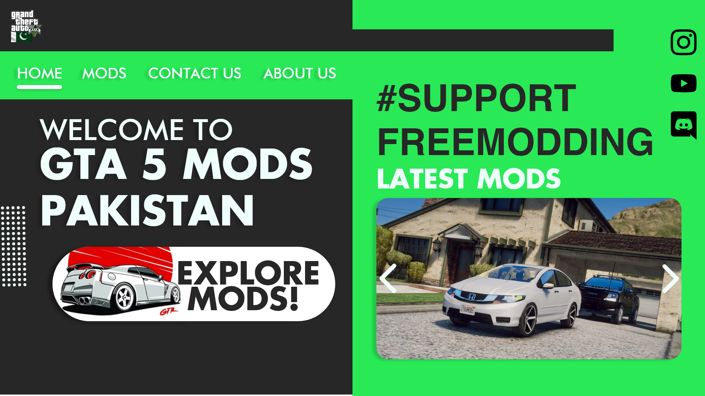
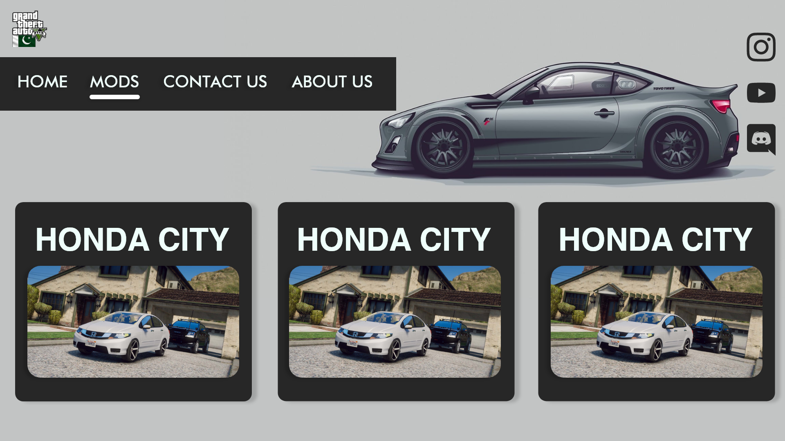
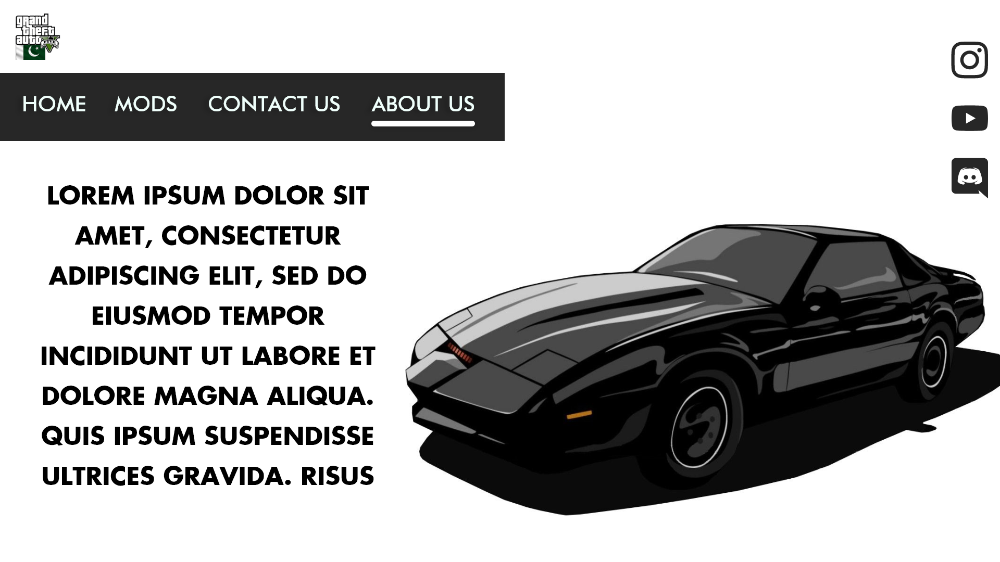
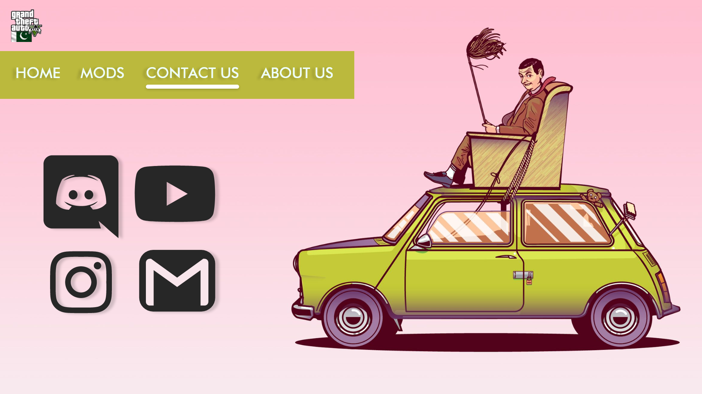

# GTA5ModsPakistan

Welcome to the **GTA5ModsPakistan** project! This is an improved version of the original GTAVModsPakistan website. The project was a collaborative effort: the design and UI/UX were handled by my friend Abdul Haseeb, while I focused on the development and coding.

## Demo

You can view the live demo of the website [here](https://ihashir.github.io/gta5modspk).

## Features

- **Collaborative Design and Development**: 
  - **UI/UX & Design**: Abdul Haseeb.
  - **Development & Coding**: Hashir Kashif.
- **PHP Version (Not Pushed)**: I also created a PHP version where the client can easily upload and modify mods. However, this version is not included in the repository for security reasons.
- **Fully Responsive**: The website is designed to be fully responsive, ensuring a seamless experience across all devices.

## Screenshots

Below are some screenshots of the website.

| Home Page | Mods Page |
|-----------|-----------|
|  |  |

| About Page | Contact Page | Mod Page Demo |
|------------|--------------|--------------|
|  |  |  |

## Technologies Used

- **HTML5**
- **CSS3**
- **JavaScript**
- **PHP (in separate version)**

## Contributing

As this project was developed for a specific client, contributions are not expected.

## License

This project is licensed under the MIT License. See the [LICENSE](LICENSE) file for more details.

## Special Thanks

A special thanks to **Abdul Haseeb** for his collaboration on this project. The main idea behind the website was his, and his efforts in handling the UI/UX and design have been crucial in bringing this project to life.
